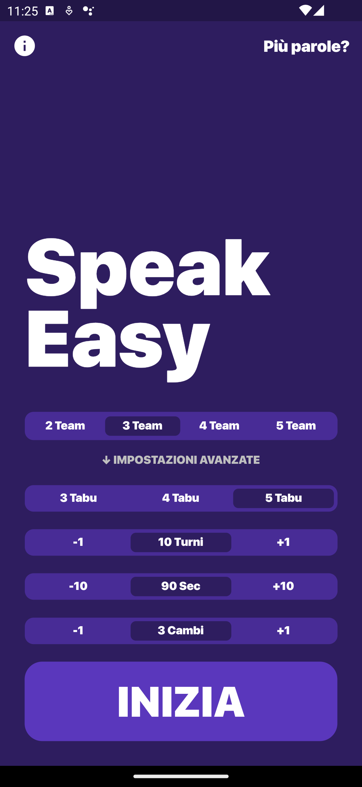
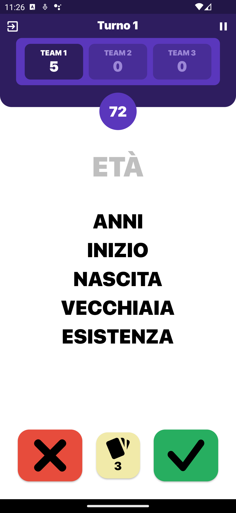

# SpeakEasy

SpeakEasy is a mobile board game app that challenges players to guess a secret word without using certain taboo words. The game tests players' creativity, wit, and ability to communicate effectively with their teammates.

  
  

## Features

- Free to download and play (200 words for free)
- No ads
- The tabus are shuffled and more than the ones displayed so every game is different
- Multi - language
- No physical cards needed; all gameplay is done through the app
- Play with friends in person
- Play as many rounds as you want 

## Getting Started

To get started with SpeakEasy, simply download the app on your Android device from the Play Store by clicking the badge below:

Once you've downloaded the app, create some groups and play with the people around you. The game will prompt you secret words to guess. 
The goal is to get your teammate to guess the secret word as quickly as possible.

## Contributing

If you'd like to contribute to the development of SpeakEasy, feel free to submit a pull request. We're always looking for ways to improve the app and make it more fun for players. You can also donate inside the app.

## Disclaimer

Please note that SpeakEasy is not affiliated with or endorsed by the official Taboo app made by Hasbro. SpeakEasy is an independent board game app that offers a different experience and gameplay.

## License

SpeakEasy is licensed under the GNU Affero General Public License v3.0.
